# 浏览器内存漫游解决方案（JS逆向）


## 一、什么鬼标题？到底是个啥鬼？
简单的说，这是一个浏览器端的内存漫游解决方案，借助此工具你可以随意检索浏览器内存中的数据（标题党警告一次），
默认看到这个项目的人都是会点逆向的， 所以可以简单理解为这是一个浏览器版本的objection，
这里的浏览器特指Chrome浏览器， 事实上在写代码的时候我也并没有考虑兼容其它的浏览器。 ：)

## 二、功能列表 
本项目刚刚立项，内存漫游功能并不是特别完善（其实只有一个功能...），目前已开发的功能： 
- 变量级抓包监控，根据加密参数秒秒钟定位到加密逻辑的代码位置（追加密逻辑代码位置的通杀方案）
  
计划开发的功能： 
- ~~指定切入点，基于AST分析依赖实现简单的自动扣代码（暂未发布，还在构思编码中，最终形态可能会有所变动，当然也很有可能会放鸽子...）~~
- 基础的定位功能的兼容性一直在搞咋也搞不完，上面那条就当我吹牛笔了...
- 目前 TODO v0.3 功能点： 
   - script hook plugins，通过script设置innerHTML动态插入到页面中的逻辑也能够Hook到
   - eval hook plugins想办法能够直接定位到jsvm中，现在只能知道是在eval中，但跳不到vm中
   - cache的逻辑优化 
   - 想办法对定位doc请求url中的加密参数能够起到一定的帮助作用（也许应该把另一个还未完全开源的hook项目直接合并进来？）


这似乎是一个新的方向，本人也是无意中想到JS逆向还有这种玩法，更多功能还在探索中（也许发现是条死路就放弃了...），
如果你有有意思的想法，请不要吝啬将其分享给我， 对于有意思的idea，我非常乐意补那个“只差一个程序员了”的缺！


## 三、本程序实现原理及流程 
划回来！请务必不要跳过此部分，在使用本程序之前，希望你能够对其原理有一个大致的了解，知其然知其所以然。

本程序的运行原理非常简单，所有的功能都是基于AST Hook构建的，其大致流程： 
1. 访问目标网站时设置浏览器走我们自定义的代理服务器，这个代理服务器要支持能够使用代码处理请求，这里选择的是anyproxy。
2. 在代理服务器这里，对请求做处理，对于JavaScript响应和HTML响应里的JS代码，使用AST实时处理，注入Hook逻辑。
3. Hook逻辑就是所有涉及到变量改动的地方都经过我们的Hook方法，以此实现页面上所有的变量值变动都可以捕获到，你可以把这理解为`内存中变量级别的抓包监控`。
4. 抓到的变量会被保存到一个变量数据库中，然后当你访问页面请求了带加密参数的请求之后，从Chrome开发者工具的Network中把那个加密参数复制出来，
   切换到console调用本工具提供的api在变量数据库中搜索一下，就能搜索到存储这个字符串的变量及变量所在的代码位置，
   单击代码位置可以自动切换到Source面板并自动定位到变量位置。
5. 然后在此处打断点往前找加密逻辑抠出来就好了，如果有多个加密参数或者加密参数为多个地方拼接生成，无脑重复此步骤即可。 

注：不要尝试去搜索`AST Hook`相关的资料，这只是一个我瞎编的词...感兴趣请自行阅读项目源码。


## 四、安装

### **注：手机端访问GitHub图片可能加载不出来，如有此情况，请使用PC端访问就好啦。**
### **再注：如果PC端也看不到图，应该是访问被阻断，可科学上网，或者把项目下载到本地用Markdown工具打开本文件查看**

### 强烈注：这里是志远大佬录制的视频教程，建议观看此视频教程安装：[https://www.bilibili.com/video/BV1so4y1o7qr/](https://www.bilibili.com/video/BV1so4y1o7qr/)

### node版本要求 
注：笔者在编码时使用到了较高版本的语法，因此请更新的您的node版本至少到14.0.0+，建议更新到最新的LTS版本。

### 下载项目并安装依赖
克隆本项目到本地：

```bash
git clone https://github.com/CC11001100/ast-hook-for-js-RE.git
```

或者WebStorm的：

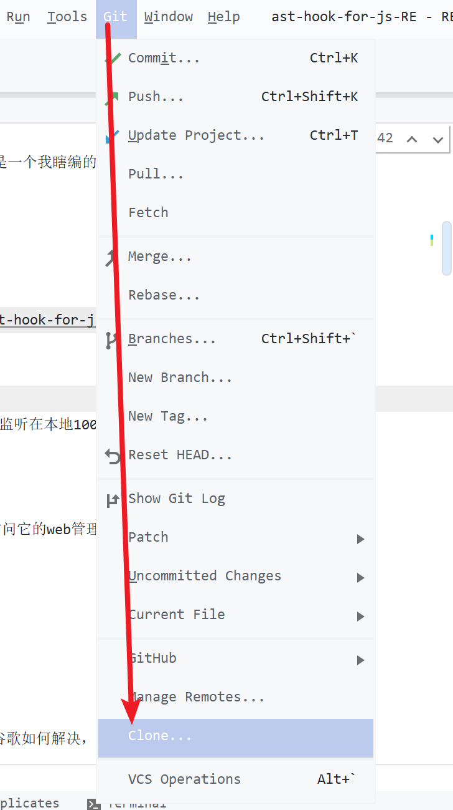

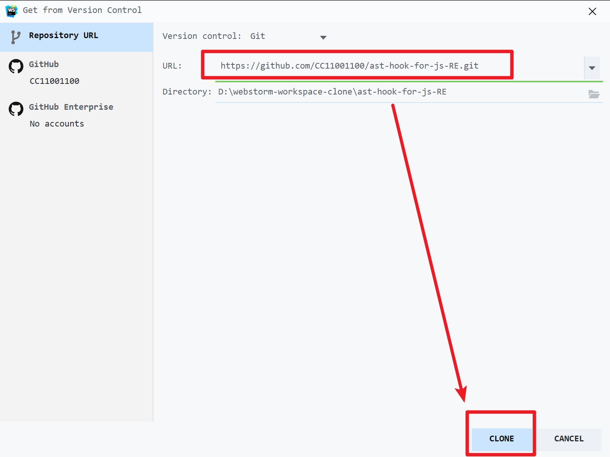

下载到本地之后安装依赖：
```bash
npm install 
```
如果是WebStorm点下右下角的提醒就可以了。

### 启动项目 
需要启动两个本地Server，anyproxy的代理Server监听在本地10086端口，运行这个文件即可： 
```text
src/proxy-server/proxy-server.js
```
要用anyproxy抓取https请求需要信任它的证书，在运行这个文件之前，先用`anyproxy ca`选项启动，访问它的web管理界面：
```text
http://localhost:8002/
```
然后下载证书信任即可： 

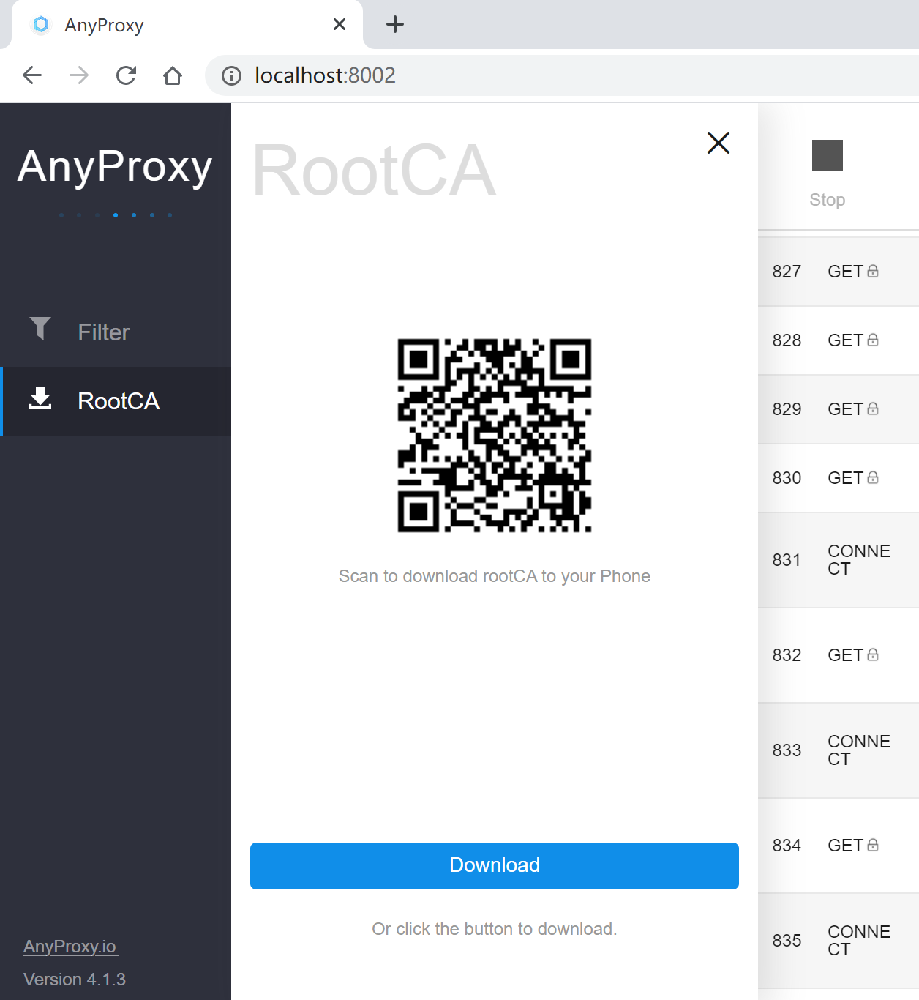

这些都属于anyproxy的安装，如果出了问题请自行谷歌如何解决，
我总不能老在自己的项目教如何安装人家的项目吧...

api-server监听在本地10010端口，运行这个文件即可：
```text
src/api-server/api-server.js
```

然后在浏览器中将代理设置为10086端口即可，这里推荐使用便携版Chrome搭建单独的调试环境，并搭配`Proxy SwitchyOmega`或类似的插件作为代理路由辅助：

[https://chrome.google.com/webstore/detail/padekgcemlokbadohgkifijomclgjgif](https://chrome.google.com/webstore/detail/padekgcemlokbadohgkifijomclgjgif)

具体方案无所谓，只要能实现走代理就可以了。

### 杂项 
因为用AST实时处理JS文件太慢了，所以设置了个缓存，缓存目录默认为：
```text
src/proxy-server/js-file-cache
```
建议将此目录加入excluded节省IDE资源，如果你使用的是WebStorm的话：


其它IDE请自行搜索如何设置。

OK，至此已经安装完毕。 

## 五、使用
目前只有一个功能，就是使用加密后的字符串去定位变量所在的代码位置，
下面会结合几个例子演示如何使用。 

注：下面的例子都是随意找的，有的可能用参数名搜索或者油猴轻量级hook追调用栈甚至xhr追调用栈更方便，
这个项目本身就是一个通杀工具，并不是针对某个站点的，
这里只是演示一下这个项目能够做什么，请勿抬杠噢！


### 案例一：猿人学第一题
这里只是作为一个演示，把anyproxy和api-server启动，浏览器挂上代理，打开这个页面：

[http://match.yuanrenxue.com/match/1](http://match.yuanrenxue.com/match/1)

打开开发者工具，然后切换到network，然后单击页面上的第二页：

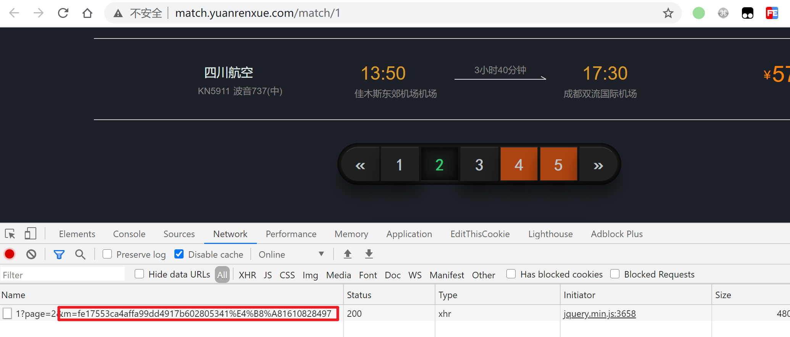

发现是有一个加密的参数叫m的，然后复制这个m的值，记得完整复制：

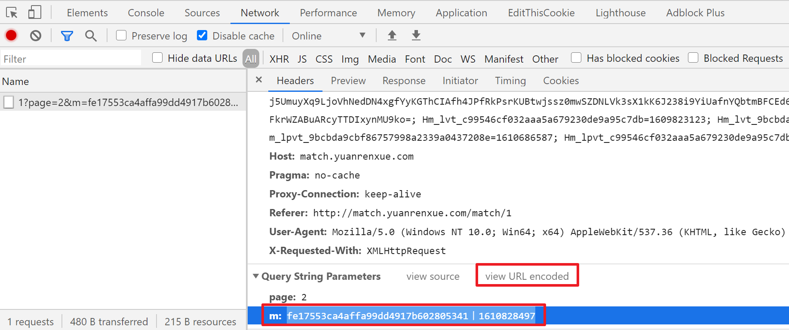

还要确保复制到的是URL解码后的，然后切换到console，尝试搜索：

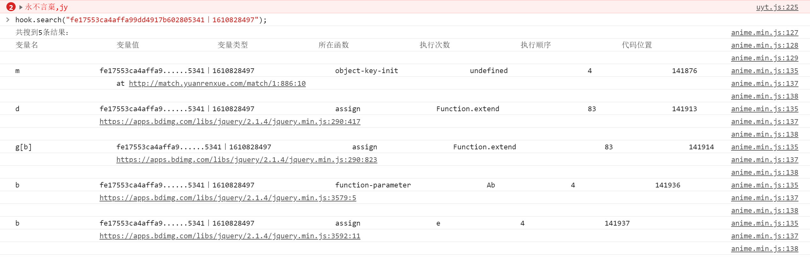

搜索结果出现了多条，除了第一个其它都是在jquery.min.js中出现的，
所以果断单击第一个的代码地址跟进去：


发现m是多个参数拼接而成的，继续往前看，m是由一个方法得到的，
已经定位到了位置，接下来跟进去扣方法就行了。

这里会发现出现了很多名为`cc11001100_hook`的函数，可以把这个函数理解为
`它会直接返回第二个参数的值`，对整体逻辑没有影响，分析时忽略它即可。

### 案例二：犀牛数据 

打开这个页面：

[https://www.xiniudata.com/](https://www.xiniudata.com/)

有一个加密参数：


然后复制值去搜一下：

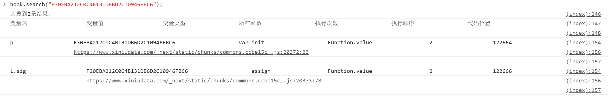

任选一个代码位置点进去，就是参数生成的地方：


在这里打个断点，往前稍微一跟，把必须的代码抠出来即可。


### 案例三：极验
打开：

[https://www.geetest.com/Sensebot](https://www.geetest.com/Sensebot)

切换到滑动验证，故意划错一次：

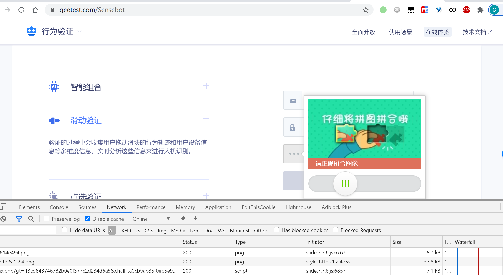

然后看网络请求：


这儿有个w参数，复制参数的值，搜它！

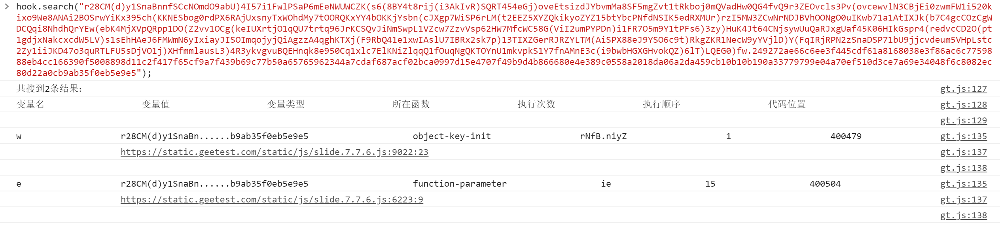 

搜到了两条结果，第一条结果只被执行了一次，并且变量名和请求参数名w一致，
因此点击它的代码位置跟进去：

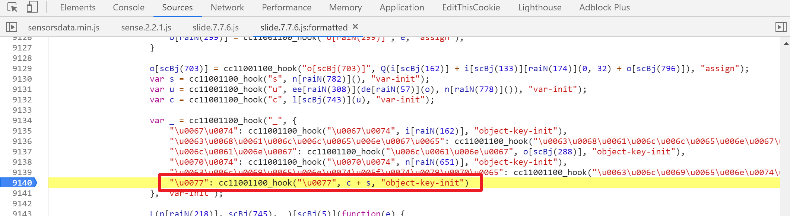

发现它也是由两个变量拼接成的，得了，就在这个位置打断点：


c的值为：
```text
"r28CM(d)y1SnaBnnfSCcNOmdO9abU)4I57i1FwlPSaMC6tY393XZD3QGfv)wTEBfzLnF2fJAPphjRRsOmG7TSjPeCqKj)4hR(o7NzPGeMLboC3MMn2b4LjgPZZCATPcwWiDq4EY2ZEqnNWzesOnc6L1nTHzT0u2xIrbY31)rhd7dkqgQDCARs9z3M0dO0ex5GsS1PqZYUylz8YjK7XNt1vAgsov3mdSLp2mNbDZuGIpBORaEeF(FdmBW1uXLcLWU0itk5awufQbtTnD4O(LN)IakFVhJ3Y3ksyqevTM1sIkeS)scG1uLWfJfK2CN2CqTIKc)Q9AawiaquYi7xnz5GCUnHMrVbtq5YefdTi1uC7yz4ttEZycm3bhGCQ)EJwraYkRh7odjUCZWNA1n7DSBFyJeuO54ediku9DTr7TOWkzEF4)VzNrH0GkB6Cf5MGhULPDrozrb5olcCGyktMg)LRTqW5yqSYlPhFB8xma51S9l9hjFsBktsbos)29lLV5cP3K(9lzPtJiVwtxoe2Rtvr73GxeWGDSrCeKn8hsbZuwwMjpJrunOXCTOQDaEx8nttFWTs8nz1nJcpl8K)bj44XzirTzfDvyPNm9(uNMlZdqy05fEfnDnz0Ntnc5oD8hmXOP9nm3oxhNIJcQCpOlGWEKVltpVZK1)EVjMTfPj2t14lOFnAEyZGrMOBt6cHFFoTD8QlkKv62Atx0zdnVcNoHm)8A(H1AS8jWUnQxPVcHcjL8m0WARkUB)iWjjwwENuCx)yRpzdPz8Y9vbQuHuQIGI7dT7zUBgmBXadwHj96BXbOb2VnInxECa0xOod5sO6"
```
s的值为：
```text
"8856cca13e058b187ba6bbbe14377b47d632dd13f65a6510a8d716b5068f9161b7507ec4e6a3b70cae22f62e68684724da04c95ff726cdec81bff04a02f6359a1161ef183418105fa468a71d1e2f0e6e90a013ea3046408c63249151508ecc860497edd46ad2a1aff81fe322a41bc8e9e6635dabc336bf0a4bdab957ee01250c"
```

搜它！这里先定位c是怎么来的： 

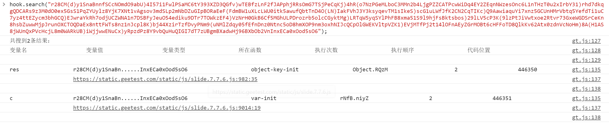

搜索结果是按照执行顺序排序的，你也能注意到执行顺序那一列是递增的，因此选择第一个最早出现的位置跟进去：


打断点，无脑重复这个过程就可以了。

再次重申，这里只是为了演示如何使用本项目，实际上对于极验的破解用AST还原一下很容易就分析清楚了不需要搞这么复杂...

### 总结套路
1. 复制请求中的参数去console搜索
2. 注意变量数据库是挂载在window上的，所以要是在当前页面上的请求才能搜到。 

### 定位到位置之后怎么办 
1. 如果只想用本工具做加密逻辑代码位置定位的话，那么可以复制周围的代码作为特征能够搜到之类即可。 
   建议的方式是Chrome复制标签页，关掉代理正常访问，从老的标签页源代码复制特征在新的标签页搜索直到定位到对应位置， 老的标签页就可以关掉了。
2. 或者可以无视Hook方法，因为Hook方法对逻辑没有任何影响。
   扣出来的代码如果是带着Hook函数的话，可以补这个函数使得代码能够正常运行：
   ```js
   /**
    *  在把代码抠出来之后，把这个方法添加到最头上以保持运行不报错，
    *  其实就是搞个同名的函数把value原样返回就可以了...
    */
   function cc11001100_hook(name, value, type) {
       return value;
   }
   ```
   如果想去除Hook函数调用的话，可以使用本项目的`src/runtime-for-result/remove-hook-function.js`文件，
   在这里配置好文件路径运行就能脱掉Hook方法了：
   
   
   

## 六、开发自定义插件

如果你有有意思的想法，也完全可以自己试下，本项目对注入到页面中的代码采用插件式设计，
你可以自己写代码然后作为插件配置上就可以生效。

1. 在`src/components/global-assign-hook-component/plugins`
   目录下创建JS文件， 插件逻辑放在这个文件中，如果有多个逻辑，
   建议多创建几个文件分开存放。
2. 将上面创建的js文件的名字配置在
   `src/components/global-assign-hook-component/core/plugins-manager.js`
   文件中的`pluginsNames`变量中：
   
   

   只配置文件名就可以。
3. 切记你的插件代码是运行在浏览器环境中的。
4. 如果要在每次捕捉到变量的时候运行你的方法，可以将其放到这个变量中： 
    ```js
    window.cc11001100_hook.hookCallback.push(stringPutToDB);
    ```
5. 更多请自行阅读代码，代码量并不多只是有些零散，相信有这个文档辅助最多一两个小时你就能完全搞明白了。

Tips：在开发插件的过程中无需频繁重启代理服务器，在配置上的时候重启一次即可，
因为那是Node代码，然后也不是每次请求的时候都会读取一次插件代码，
读取硬盘上的插件代码缓存有3秒， 超过3秒会从硬盘再读取一次，这是为了方便调试。

目前已经内置的插件：
- string-put-to-db-plugins.js：是为了能够将抓到的字符串类型的变量放到内存数据库
- search-strings-db-plugins.js： 提供搜索变量数据库的能力
- eval-hook-plugins.js：是为了能够Hook使用eval执行的代码  

项目的框架基本就是这样了，后续再增加功能也会是以增加插件的形式增加。 


## 七、问题反馈 
在issues中发帖即可，我看到后会尽快处理。 


